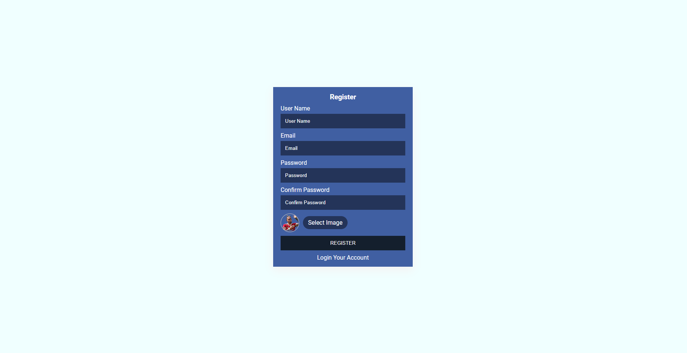
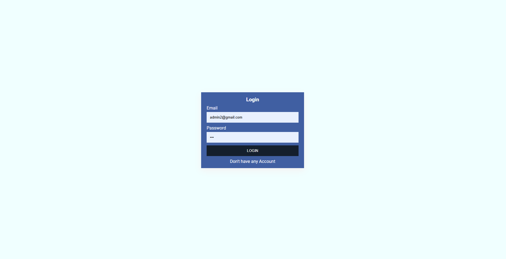
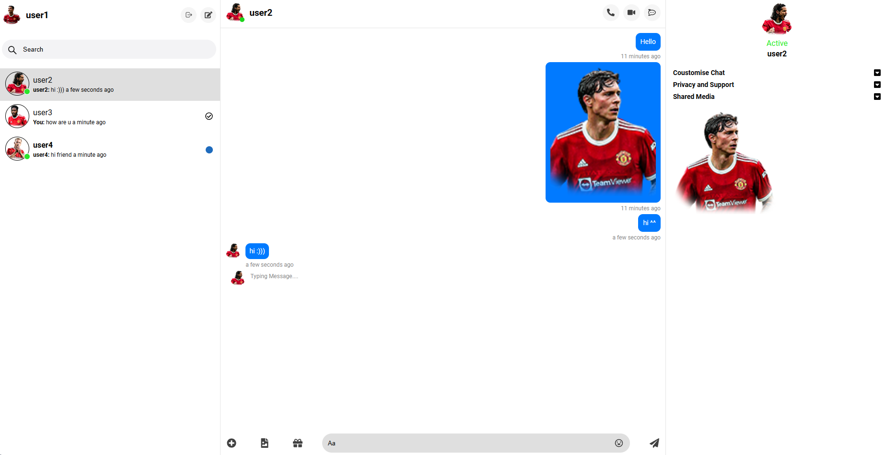

# Budget Messenger

- A MERN stack project that implements a chat application with features similar to Messenger using Socket.IO, but much simpler.
- [Demo and detailed explaination](https://youtu.be/3YGU2mHhtSg)

## Features

- User registration and login
- View list of online friends realtime
- Send text messages
- Send images
- Chat app behaviors:
  - New message notifications
  - Typing indicators
  - Message status: sending, sent, delivered, seen
- Synchronization across multiple logged-in devices

## Technologies

- **MERN Stack**
  - **Frontend:** React, Redux Toolkit, SASS, RTK Query, use-sound
  - **Backend:** Node.js, Express, MongoDB (Mongoose)
- **Real-time communication:** Socket.IO

## Screenshots

### Register Page


### Login Page


### Chat Page



## Project Setup

1. Clone the repository:
   ```sh
   git clone https://github.com/npvu1510/budget_messenger.git
   
2. Install dependencies:
   ```sh
   npm install
   
3. Set up environment variables:
   Create a `.env` file in the root directory and add the necessary environment variables. An example `.env` file:
   ```env
    PORT = 5000
    
    MONGODB_URI_STRING = ...
    
    JWT_SECRET_KEY = ...
    
    JWT_EXPIRES_IN = 24h
    COOKIE_EXPIRES_IN_DAY = 100

4. Start server:
   ```sh
   npm run server

5. Start client:
   ```sh
   npm run client

6. Start socket:
   ```sh
   cd socket
   npm run server

## Project Structure
```sh
budget-messenger/
├── backend/
│ ├── config/
│ ├── controllers/
│ ├── middlewares/
│ ├── models/
│ ├── routes/
│ ├── utils/
│ ├── app.js
│ └── server.js
├── frontend/
│ ├── public/
│ ├── src/
│ ├── package-lock.json
│ ├── package.json
│ └── README.md
├── node_modules/
├── screenshots/
├── socket/
├── uploads/
├── .env
├── .gitignore
├── index.html
├── package-lock.json
├── package.json
└── README.md

## Contribution
Feel free to fork this project and submit pull requests. Any contributions are greatly appreciated.

## License
This project is licensed under the MIT License.
